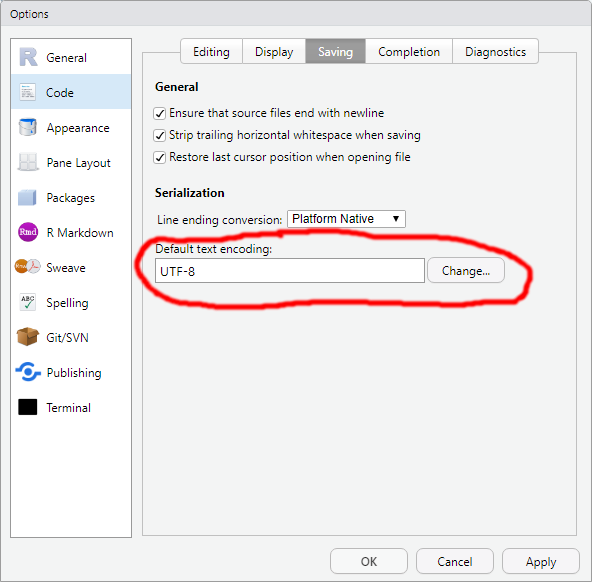

# Analiza danych ilościowych z wykorzystaniem R  

## [3502-SCC-ADR gr. 3.]

# Zarys programu

1.-2. blok zajęć: podstawy R: import danych, proste przekształcenia *ramek danych* i wektorów z wykorzystaniem składni *base R*;

3.-5. blok zajęć: przekształcanie danych, tworzenie rozkładów i zestawień statystyk przy użyciu pakietów *tidyr* i *dplyr*;

6.-7. blok zajęć: wizualizacja danych z wykorzystaniem pakietu *ggplot2*;

8. kolokwium zaliczeniowe, prezentacje projektów badawczych;

# Zasady zaliczenia

Ocena końcowa z przedmiotu składa się z:

- 20% oceny za bieżące przygotowanie do zajęć;
  - aktywny udział w zajęciach;
  - wejściówki: na każdych zajęciach, poza pierwszymi i ostatnimi, studenci otrzymają do wykonania zadanie, sprawdzające ich wiedzę z oprzednich zajęć; do zaliczenia wymagane jest poprawne rozwiązanie przynajmniej połowy zadań;
- 30% oceny z pracy nad projektem badawczym:
  – studenci zostaną podzieleni na dwu- lub trzyosobowe grupy, każda z grup będzie pracować nad projektem badawczym, polegającym na analizie wybranego zbioru danych ilościowych oraz prezentacji wyników;
  - szczegóły - p. niżej;
- 50% oceny z kolokwium końcowego:
  - kolokwium będzie się składało z 7‑9 zadań,
  - w trakcie kolokwium studenci będą mogli korzystać z notatek.

Warunkiem zaliczenia przedmiotu jest otrzymanie ocen co najmniej dostatecznych z każdej z trzech wymienionych wyżej „składowych”. 

# Projekt badawczy

## Sposób realizacji projektu

- Projekt wykonywany jest w zespołach 2‑3 osobowych. Uczestnicy zajęć samodzielnie dobierają się w zespoły i zgłaszają ich skład prowadzącemu.
  - Skład zespołów powinien być zgłoszony przed drugimi zajęciami (25 lutego 2020).
  - W przypadku, gdyby wszyscy uczestnicy zajęć nie dobrali się w zespoły samodzielnie, prowadzący może zmodyfikować skład zespołów.

- Zespół wybiera temat projektu, który będzie realizował.
  - Można wybrać jeden z tematów zaproponowanych przez prowadzących (p. niżej) lub samodzielnie zaproponować zbiór danych i temat analiz, z tym że musi on zostać zaakceptowany przez prowadzącego.
  - Wybór (lub własna propozycja) tematu powinien zostać zgłoszony prowadzącemu przed drugimi zajęciami (25 lutego 2020).
  
- Zespoły zobowiązane są **systematycznie pracować nad realizacją projektu badawczego**. W związku z tym prowadzącemu należy przesłać:
  - Przed trzecimi zajęciami (3 marca 2020) dokument zawierający:
    - Krótkie uzasadnienie wyboru tematu - jeden akapit wskazujący dla kogo i dlaczego wyniki tych analiz będą interesujące.
    - Opis źródła danych: co dane, ogólnie rzecz biorąc, opisują, skąd zostały pobrane i ew. jakie jest ich pierwotne źródło, jaka była ich forma: co było jednostką obserwacji w zbiorze, jak wiele było w zbiorze wierszy i kolumn (jeśli dane składały się z wielu zbiorów - oddzielnie dla każdego z nich).
    - Opis planowanych analiz: jakie zmienne zostaną w nich wykorzystane, i ew. w jaki sposób planuje się je przekształcać; jakie statystyki i dla jak zdefiniowanych grup planuje się obliczyć, aby zilustrować badany problem.
  - Przed piątymi zajęciami (17 marca 2020) notebook R zawierający:
    - Uzasadnienie wyboru tematu i opis źródła danych z wcześniej przygotowanego dokumentu.
    - Kod przekształcający dane w celu przygotowania ich do właściwych analiz wraz z opisem dokonywanych przekształceń.
    - Jeśli dane nie wymagają większej obróbki przed przystąpieniem do obliczeń: kod pozwalający uzyskać wstępne wyniki analiz, wraz z opisem, co przeprowadzone analizy pozwalają pokazać.
  - Przed siódmymi zajęciami (31 marca 2020) ww. notebook R uzupełniony o kod pozwalający uzyskać ostateczne wyniki analiz, wraz z opisem, co przeprowadzone analizy pozwalają pokazać.
  - Do 20 kwietnia (?) ww. notebook R, uzupełniony o sekcję, w której najważniejsze (najbardziej interesujące) wyniki zostaną estetycznie zilustrowane przy pomocy tabel i wykresów (sekcja powinna zawierać 1‑3 tabele i 2‑4 wykresów).

## Tematy projektów

Tematy przygotowane przez prowadzących zajęcia (pogrupowane wg zbiorów danych, numery oznaczają kolejne tematy):

**[Piosenki (wybrane) z serwisu Spotify](https://github.com/rfordatascience/tidytuesday/tree/master/data/2020/2020-01-21):**

1. Pokaż, od czego zależy popularność piosenek w serwisie Spotify.
2. Pokaż, jakie są różnice pomiędzy utworami muzycznymi zaliczającym się do różnych stylów muzycznych.
3. Analizując dane, zidentyfikuj wykonawców, dla których w ciągu ostatnich 10 lat:
   - kolejne wydawane płyty cieszą się coraz większą popularnością;
   - kolejne wydawane płyty cieszą się coraz mniejszą popularnością.
   Wybierz kilka najbardziej jaskrawych przypadków i zilustruj, jak przebiegają dla nich takie związki.

**[Zatrudnienie i zarobki kobiet w USA](https://github.com/rfordatascience/tidytuesday/tree/master/data/2019/2019-03-05):**  

4. Pokaż wielkość różnic dochodowych pomiędzy kobietami a mężczyznami w różnych grupach zawodowych. Pokaż, jak wielkość różnic dochodowych pomiędzy kobietami a mężczyznami zmienia się w cyklu życia (tj. dla osób w różnym wieku) i jak przebieg tego związku zmienił się w czasie.

**[Pasażerowie Titanica (wielki klasyk)](https://dasl.datadescription.com/datafile/titanic):** 

5. Pokaż, od czego zależały szanse przeżycia katastrofy.

**[Ceny domów w Saratodze](https://dasl.datadescription.com/datafile/saratoga-houses):**

6. Pokaż, od czego zależy cena domów w tym amerykańskim mieście.

# Instalacja R

Realizacja projektu badawczego będzie **wymagać instalacji R na komputerach uczestników zajęć**:

## Skąd pobrać?

- Instalator R należy pobrać ze strony [CRAN](https://cran.r-project.org).
- Instalator RStudio należy pobrać ze strony [dostawcy](https://www.rstudio.com/products/rstudio/download/#download).

## Co ustawić po instalacji?

**Po pierwszym otwarciu RStudio należy ustawić domyślne kodowanie plików z kodem na UTF-8.**  
(Pozwoli to uniknąć *krzaczenia się* polskich znaków w materiałach do kursu.)

W tym celu (por. rysunek poniżej):

- z menu *Tools* RStudio wybieramy opcję *Global Options*;
- w oknie, które się pojawi, spośród listy ikon po lewej wybieramy *Code*, a następnie w prawej części okna zakładkę *Saving*;
- klikamy przycisk *Change...* obok pola podpisanego *Default text encoding:* i w okienku, które się pokaże, wybieramy opcję *UTF-8*;
- akceptujemy wybór, a następnie zmianę opcji klikając przyciski *OK*.

## Rozwiązywanie problemów

W przypadku problemów z instalacją lub używaniem R/RStudio na swoim prywatnym komputerze, należy zgłosić się do prowadzącego zajęcia **pod koniec drugich zajęć (25 lutego 2020)** - oczywiście przynosząc swój komputer, aby móc pokazać, na czym dokładnie polega problem.

# Materiały z zajęć

- [1. zajęcia 18.02.2020](zajecia-1.zip) - materiały do pobrania;
- [2. zajęcia 25.02.2020](zajecia-2.zip) - materiały do pobrania;
- [3. zajęcia 3.03.2020](zajecia-3.zip) - materiały do pobrania;

# Materiały uzupełniające (do pobrania)

- Podstawy zarządzania środowiskiem R (dodatkowe pakiety, aktualizacje itp.) - dokument po angielsku:
  - [plik .Rmd](dodatkowe/R-management-basics.Rmd) - można pobrać i samodzielnie *sknitować* (skompilować) do HTML;
  - skompilowany [plik HTML](dodatkowe/R-management-basics.html) - należy pobrać na dysk i dopiero stamtąd otworzyć w przeglądarce (GitHub nie otwiera plików HTML jako stron internetowych);
- Specjalne wartości liczbowe w R:
  - [plik .Rmd](dodatkowe/specjalne-wartosci-liczbowe.Rmd) - można pobrać i samodzielnie *sknitować* (skompilować) do HTML;
  - skompilowany [plik HTML](dodatkowe/specjalne-wartosci-liczbowe.html) - należy pobrać na dysk i dopiero stamtąd otworzyć w przeglądarce (GitHub nie otwiera plików HTML jako stron internetowych);
